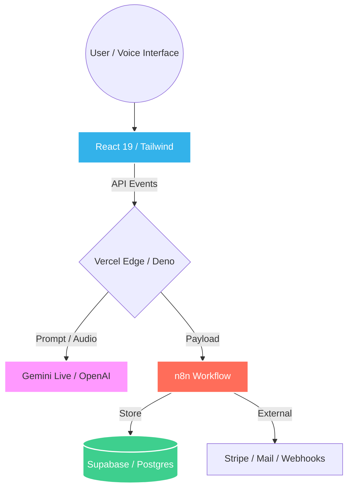

<h1 align="center">Anton Brunel</h1>

  

  
  
  
  

---

# About

I build **real web products using AI-generated code**, then make them **actually operable** in production.

I can't call myself a developer. I am a **Product Builder**. My value doesn't lie in the lines of code, but in orchestrating intelligence to solve business problems.

• **UX Architecture** | From first scroll to conversion.  
• **Business Funnels** | Turning traffic into leads and revenue.  
• **Data Orchestration** | Managing flows between UI, AI, and DB.  
• **Automation** | Deleting manual tasks with n8n pipelines.  
• **AI Integration** | Not just a chatbot, but a core feature.  
• **Rapid Iteration** | From idea to live product in days, not months.

🥬 **Carbon offset strategy** : Using a lot of AI... so I’m **vegan to balance my energy karma (not even joking).**

---

# Products Architecture
### How the system actually works

---

# Operating Infrastructure

Building is only 50% of the job. I ensure the product is **live, scalable, and monitored.**

| Layer | Provider | Core Role | Ecosystem Status |
| --- | --- | --- | --- |
| **Intelligence** | `Gemini / Claude` | Reasoning & Voice Interaction | Optimized & Latency-ready |
| **Logic & Flows** | `n8n / Node.js` | Business Rules & Orchestration | Automated & Error-handled |
| **Database** | `Supabase / RAG` | Real-time Data & RLS Security | Persistent, AI friendly & Secure |
| **Runtime** | `Vercel / Deno` | Serverless Execution | Edge-deployed |
| **PWA / UX** | `Vite / React` | Responsive Interface | Operational |

---

# Stack & Infrastructure

### AI Tools

---

### Ops & Infrastructure

---

# Tech Stack Details

### Frontend Engineering

* **Core:** React 18/19, TypeScript, Vite, SPA architecture.
* **UI System:** Tailwind CSS, shadcn/ui, Radix UI, Framer Motion.
* **State & Data:** TanStack React Query, Context API, Zod validation, React Hook Form.

### AI & Voice Integration

* **Engines:** Gemini Live API (real-time voice streaming), OpenAI APIs, Claude.
* **Architecture:** Prompt engineering, AI guardrails, Contextual interaction design.
* **Audio:** Web Audio API, PCM processing, AudioContext.

### Robustness & Edge Features

* **PWA:** Service workers and offline-ready flows.
* **Resilience:** Local persistence, session recovery, and no-data-loss logic.
* **Real-time UX:** Silent reconnection and state synchronization.
* **Mobile:** Memory-safe image processing and low-friction mobile flows.

---

# Featured Projects

<table border="0">
<tr>
<td width="33%" valign="top">
<h3>Step Up Factory</h3>

<b>Transformation Studio</b>

<i>Visual proof engine for fitness results.</i>

<ul>
<li>Before/After editor</li>
<li>Lead generation funnel</li>
<li>Mobile image pipeline</li>
</ul>
<a href="https://resultats.stepupfactory.fr">Visit Project</a>
</td>
<td width="33%" valign="top">
<h3>Aether UX</h3>

<b>Booking System</b>

<i>Live coach booking with real-time editing.</i>

<ul>
<li>Automated funnel</li>
<li>n8n orchestration</li>
<li>Custom slug system</li>
</ul>
<a href="https://bilan.stepupfactory.fr">Visit Project</a>
</td>
<td width="33%" valign="top">
<h3>D’Artgil Café</h3>

<b>Voice Assistant</b>

<i>Real-time voice AI for local business.</i>

<ul>
<li>Bidirectional streaming</li>
<li>Gemini Live API</li>
<li>Instant FAQ & Booking</li>
</ul>

<i>Development in progress</i>

</td>
</tr>
<tr>
<td width="33%" valign="top">
<h3>Sudoku Multiplayer</h3>

<b>Real-time Game</b>

<i>Collaborative experience with sync recovery.</i>

<ul>
<li>Cooperative & Versus</li>
<li>Instant reconnection</li>
<li>State persistence</li>
</ul>
<a href="https://sudoku-together-36386059600.us-west1.run.app">Play Now</a>
</td>
<td width="33%" valign="top">
<h3>QSE Brunel</h3>

<b>Industrial Training</b>

<i>Immersive platform for workplace safety.</i>

<ul>
<li>AI Scenario generator</li>
<li>Investigation engine</li>
<li>Performance analytics</li>
</ul>

<i>URL coming soon</i>

</td>
<td width="33%" valign="top" align="center">

<b>Next Project?</b>

Could be yours.

<a href="https://github.com/antonbrunel">Get in touch</a>
</td>
</tr>
</table>

---

# Capabilities

### Product

• Idea to product architecture

• Conversion funnels

• UX design

• Business logic

### Engineering Orchestration

• AI-generated code into maintainable modules

• Automation workflows (n8n)

• Infrastructure deployment

• Data pipelines

### AI Integration

• Prompt engineering and system constraints

• Conversational systems (text + voice)

• Guardrails and safe UX

---

# Philosophy

**Speed > perfection :** Build fast

Ship real things

Learn from usage

---

# Connect

---

If you have a project involving AI in mind, feel free to reach out or follow the repository.
