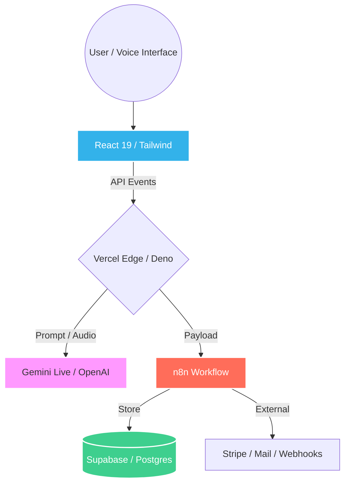

 
<h1 align="center">Anton Brunel</h1>

  

  
  
  
  

 

---
 

# About

I build **real web products using AI-generated code**, then make them **actually operable** in production.

I don't call myself a developer. I am a **Product Builder**. My value doesn't lie in the lines of code, but in orchestrating intelligence to solve business problems.

  

&bull; **UX Architecture** | From first scroll to conversion.  
&bull; **Business Funnels** | Turning traffic into leads and revenue.  
&bull; **Data Orchestration** | Managing flows between UI, AI, and DB.  
&bull; **Automation** | Deleting manual tasks with n8n pipelines.  
&bull; **AI Integration** | Not just a chatbot, but a core feature.  
&bull; **Rapid Iteration** | From idea to live product in days, not months.

🥬 **Carbon offset strategy** : Using a lot of AI... so I'm **vegan to balance my energy karma (not even joking).**

 

---
 

# Products Architecture
### How the system actually works

```mermaid
graph TD
    User((User / Voice Interface)) --> UI[React 19 / Tailwind]
    UI -- "API Events" --> Edge{Vercel Edge / Deno}
    Edge -- "Prompt / Audio" --> AI[Gemini Live / OpenAI]
    Edge -- "Payload" --> Automation[n8n Workflow]
    Automation -- "Store" --> DB[(Supabase / Postgres)]
    Automation -- "External" --> Actions[Stripe / Mail / Webhooks]

    style UI fill:#33B2EA,stroke:#fff,stroke-width:2px,color:#fff
    style AI fill:#f9f,stroke:#fff,stroke-width:2px
    style DB fill:#3ecf8e,stroke:#fff,stroke-width:2px,color:#fff
    style Automation fill:#ff6d5a,stroke:#fff,stroke-width:2px,color:#fff
```

 

---
 

# Operating Infrastructure

Building is only 50% of the job. I ensure the product is **live, scalable, and monitored.**

| Layer | Provider | Core Role | Ecosystem Status |
| --- | --- | --- | --- |
| **Intelligence** | `Gemini / Claude` | Reasoning & Voice Interaction | Optimized & Latency-ready |
| **Logic & Flows** | `n8n / Node.js` | Business Rules & Orchestration | Automated & Error-handled |
| **Database** | `Supabase / RAG` | Real-time Data & RLS Security | Persistent, AI friendly & Secure |
| **Runtime** | `Vercel / Deno` | Serverless Execution | Edge-deployed |
| **PWA / UX** | `Vite / React` | Responsive Interface | Operational |

 

---
 

# Stack & Infrastructure

### AI Tools

 

### Ops & Infrastructure

 

---
 

# What I Ship

<table border="0">
  <tr>
    <td width="50%" valign="top">
      <h3>Products</h3>
      

        
        
        
        
      

    </td>
    <td width="50%" valign="top">
      <h3>Automation</h3>
      

        
        
        
      

    </td>
  </tr>
  <tr>
    <td width="50%" valign="top">
      <h3>Integrations</h3>
      

        
        
        
        
        
        
        
        
      

    </td>
    <td width="50%" valign="top">
      <h3>Security</h3>
      

        
        
        
        
      

    </td>
  </tr>
</table>

 

---
 

### GitHub Velocity

  
  

> **Continuous Iteration** | High-velocity building across private production environments and AI-integrated systems.

 

---
 

# Featured Projects

<table border="0">
  <tr>
    <td width="50%" valign="top">
      <h3>StepUp Factory Suite</h3>
      
<b>Coach-to-Client Conversion Ecosystem</b>

      
<i>Three connected products, one seamless journey — from first impression to booked session.</i>

      <ul>
        <li>Landing hub with live Google Maps reviews, real-time public results count & smart redirects</li>
        <li>Before/After gallery + lead generation funnel (resultats.stepupfactory.fr)</li>
        <li>Fully customizable booking system with n8n orchestration & custom slug per coach (bilan.stepupfactory.fr)</li>
        <li>Coach identity propagated across all three apps via URL params & localStorage — one link, full context</li>
      </ul>
      <a href="https://stepupfactory.fr">Visit stepupfactory.fr</a>
       
    </td>
    <td width="50%" valign="top">
      <h3>Vocal Flow</h3>
      
<b>AI Voice Agent Full Stack Platform</b>

      
<i>Turn every missed call into a handled conversation — your business never stops answering.</i>

      <ul>
        <li>Real-time voice AI over phone calls (Twilio + OpenAI Realtime API, ~500ms latency)</li>
        <li>Multi-tenant SaaS with Google Calendar booking, SMS alerts, and per-tenant prompt configuration</li>
        <li>Two pipeline modes: ultra-low latency (OpenAI Realtime) or modular (Deepgram STT → GPT-4o → ElevenLabs TTS)</li>
      </ul>
      <a href="https://app.antton-brunel.com">Enjoy demo access</a>
       
    </td>
  </tr>
  <tr>
    <td width="50%" valign="top">
      <h3>Sudoku Multiplayer</h3>
      
<b>Real-time Game</b>

      
<i>Collaborative experience with sync recovery.</i>

      <ul>
        <li>Unique Cooperative & Versus modes</li>
        <li>Actually enjoyable design</li>
        <li>Live and State persistence</li>
      </ul>
      <a href="https://sudoku-together-36386059600.us-west1.run.app">Play Now</a>
       
    </td>
    <td width="50%" valign="top">
      <h3>QSE Brunel</h3>
      
<b>Industrial Training</b>

      
<i>Immersive platform used as a teaching tool for professionals and students.</i>

      <ul>
        <li>Deeply personalized scenario generation</li>
        <li>Investigation engine</li>
        <li>Performance analytics & feedback</li>
      </ul>
      <a href="https://qse.antton-brunel.com">Visit Project</a>
       
    </td>
  </tr>
  <tr>
    <td width="50%" valign="middle" align="center" colspan="2">
       
      
<b>Next Project?</b>

      
Could be yours.

      <a href="https://wa.me/33783005392?text=Hi%20Anton!%20I'm%20reaching%20out%20from%20your%20GitHub.%20I%20have%20a%20project%20idea%20and%20I'd%20love%20to%20discuss%20how%20we%20could%20build%20it%20together.">Get in touch</a>
       
      <small><i>I would love to hear about your vision.</i></small>
    </td>
  </tr>
   
</table>

  
  &nbsp;
  

 

---
 

# Capabilities

<b>From Idea to Live Product</b>

 

<b>Orchestration Over Code</b>

 

<b>AI as a Core Feature</b>

 

 

---

 

<h2 align="center">Terminal Resume</h2>

  Run this <b>from your terminal</b>

  

  <code>ssh -p 32013 portfolio@43.157.1.94</code>

  <small>No terminal handy? Check the <a href="https://portfolio.antton-brunel.com">Web Portfolio</a> instead.</small>

 

# Connect

  
  

If you have a project in mind, feel free to reach out.

*If you made it this far, you clearly have good taste.*  
Enjoy a bit more lettuce 🥬🥬🥬
